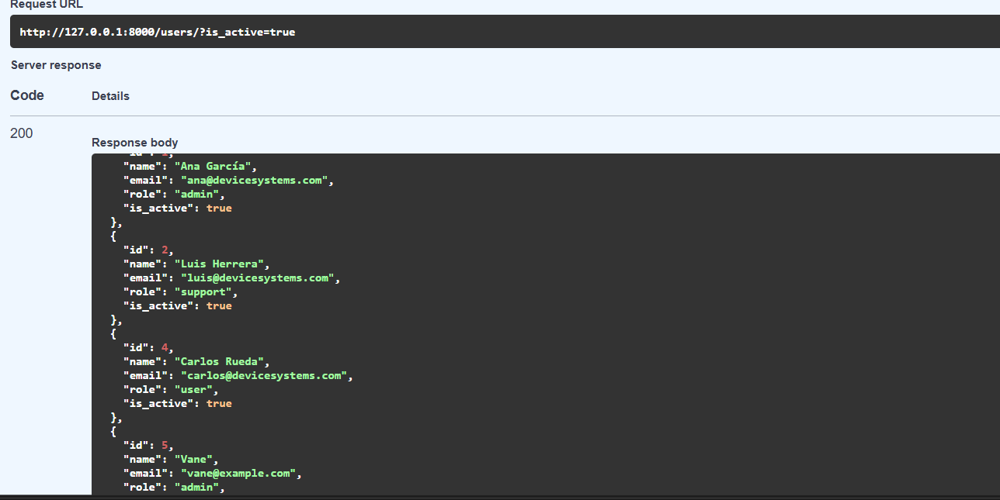
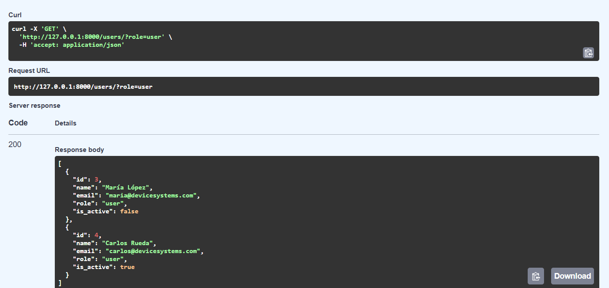
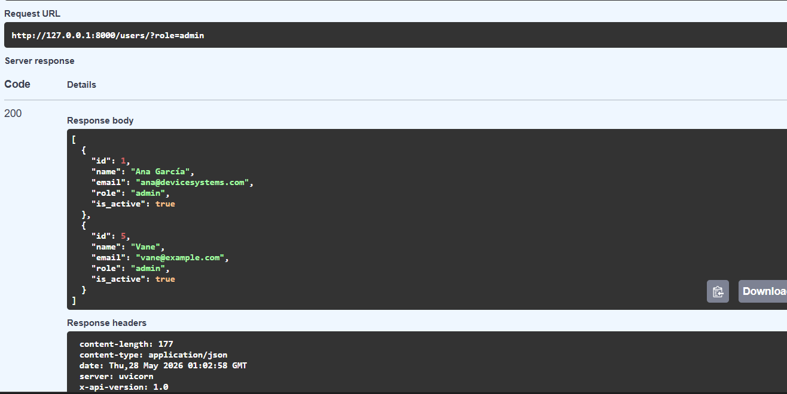
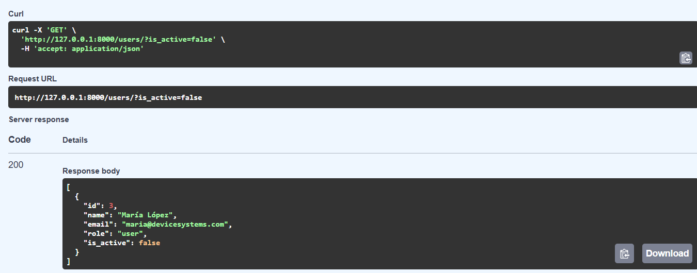
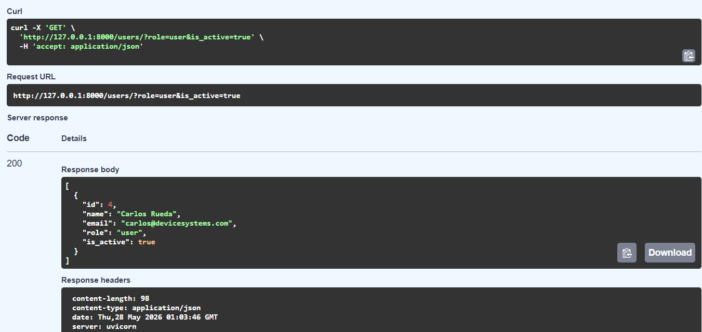
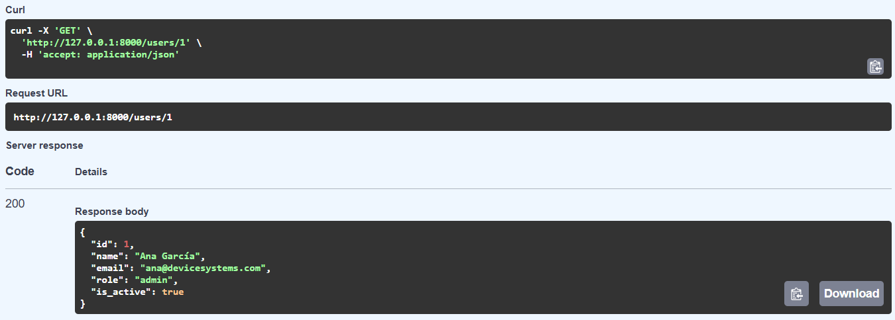
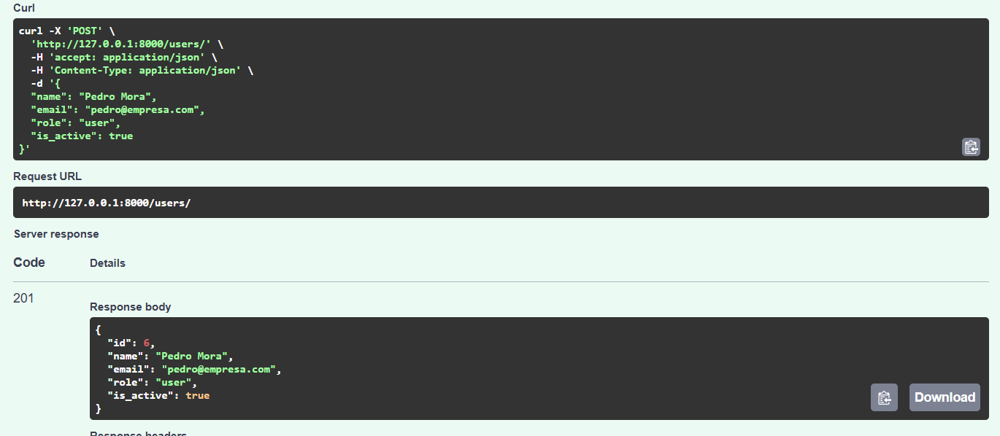

# device_systems API

API REST construida con **FastAPI** y **Python** para administrar usuarios del sistema **device_systems**.

## Descripción de la aplicación

`device_systems` es una API REST que permite gestionar los usuarios de un sistema de dispositivos. Está diseñada para equipos de soporte técnico que necesitan administrar roles de acceso (administradores, soporte y usuarios finales).

Características principales:
- Listado de usuarios con filtros por rol y estado activo/inactivo.
- Consulta individual de usuarios por ID.
- Registro de nuevos usuarios con validación completa de datos.
- Respuestas estandarizadas con modelos de entrada/salida separados (Pydantic).
- Cabeceras HTTP personalizadas en cada respuesta.
- Documentación interactiva automática con Swagger UI.

Tecnologías usadas:
- **FastAPI** — framework web moderno y rápido para construir APIs con Python.
- **Pydantic v2** — validación de datos y serialización.
- **Uvicorn** — servidor ASGI de alto rendimiento.

---

## Requisitos previos

- Python 3.10 o superior
- pip
- Git

---

## Instalación de dependencias

```bash
# 1. Clonar el repositorio
git clone https://github.com/tu-usuario/device_systems.git
cd device_systems

# 2. Crear entorno virtual
python -m venv venv

# Activar en Windows:
venv\Scripts\activate

# Activar en Mac/Linux:
source venv/bin/activate

# 3. Instalar dependencias
pip install -r requirements.txt
```

Contenido de `requirements.txt`:
```
fastapi==0.115.0
uvicorn==0.30.6
pydantic[email]==2.8.2
```

---

## Ejecución del servidor

```bash
uvicorn app.main:app --reload
```

El flag `--reload` hace que el servidor se reinicie automáticamente al guardar cambios en el código (útil en desarrollo).

URLs disponibles una vez iniciado el servidor:

| Recurso        | URL                          |
|----------------|------------------------------|
| API base       | http://127.0.0.1:8000        |
| Swagger UI     | http://127.0.0.1:8000/docs   |
| ReDoc          | http://127.0.0.1:8000/redoc  |

---

## Estructura del proyecto

```
device_systems/
├── app/
│   ├── __init__.py
│   ├── main.py                  ← Instancia de FastAPI y registro de rutas
│   ├── schemas/
│   │   ├── __init__.py
│   │   └── user_schema.py       ← Modelos Pydantic: UserCreate, UserInDB, UserOut
│   └── routes/
│       ├── __init__.py
│       └── user_routes.py       ← Endpoints GET y POST del recurso /users
├── requirements.txt             ← Dependencias del proyecto
└── README.md                    ← Este archivo
```

### Rol de cada archivo

| Archivo | Responsabilidad |
|---|---|
| `main.py` | Crea la app FastAPI, registra el router de usuarios, define el endpoint raíz `/` |
| `user_schema.py` | Define `UserCreate` (entrada), `UserInDB` (almacenamiento), `UserOut` (salida) |
| `user_routes.py` | Implementa `GET /users`, `GET /users/{id}`, `POST /users` con toda la lógica |

---

## Tabla de endpoints

| Método | Ruta               | Código éxito | Descripción                          |
|--------|--------------------|:------------:|--------------------------------------|
| GET    | `/`                | 200          | Bienvenida y estado de la API        |
| GET    | `/users`           | 200          | Lista todos los usuarios             |
| GET    | `/users?role=`     | 200          | Filtra usuarios por rol              |
| GET    | `/users?is_active=`| 200          | Filtra usuarios por estado           |
| GET    | `/users/{user_id}` | 200          | Obtiene un usuario por ID            |
| POST   | `/users`           | 201          | Crea un nuevo usuario                |

### Códigos de error posibles

| Código | Significado                                      |
|:------:|--------------------------------------------------|
| 404    | Usuario no encontrado (GET por ID inexistente)   |
| 409    | Conflicto: el email ya está registrado (POST)    |
| 422    | Error de validación: datos de entrada inválidos  |

---

## Modelos de datos

### Entrada — `UserCreate` (body del POST)

| Campo       | Tipo    | Requerido | Validación                              |
|-------------|---------|:---------:|-----------------------------------------|
| `name`      | string  | ✅        | Mínimo 3 caracteres                     |
| `email`     | string  | ✅        | Formato de email válido                 |
| `role`      | string  | ✅        | Solo: `admin`, `support`, `user`        |
| `is_active` | boolean | ❌        | Por defecto `true`                      |

### Salida — `UserOut` (respuesta de todos los endpoints)

| Campo       | Tipo    | Descripción              |
|-------------|---------|--------------------------|
| `id`        | integer | Identificador único      |
| `name`      | string  | Nombre del usuario       |
| `email`     | string  | Correo electrónico       |
| `role`      | string  | Rol asignado             |
| `is_active` | boolean | Estado activo/inactivo   |

---

## Ejemplos de peticiones

### GET /users — Listar todos los usuarios: 

```http
GET http://127.0.0.1:8000/users
```

Respuesta `200 OK`:
```json
[
  {
    "id": 1,
    "name": "Ana García",
    "email": "ana@devicesystems.com",
    "role": "admin",
    "is_active": true
  },
  {
    "id": 2,
    "name": "Luis Herrera",
    "email": "luis@devicesystems.com",
    "role": "support",
    "is_active": true
  },
  {
    "id": 3,
    "name": "María López",
    "email": "maria@devicesystems.com",
    "role": "user",
    "is_active": false
  }
]
```

---

### GET /users?role=admin — Filtrar por rol:  - 

```http
GET http://127.0.0.1:8000/users?role=admin
```

Respuesta `200 OK`:
```json
[
  {
    "id": 1,
    "name": "Ana García",
    "email": "ana@devicesystems.com",
    "role": "admin",
    "is_active": true
  }
]
```

---

### GET /users?is_active=false — Filtrar por estado inactivo: 

```http
GET http://127.0.0.1:8000/users?is_active=false
```

Respuesta `200 OK`:
```json
[
  {
    "id": 3,
    "name": "María López",
    "email": "maria@devicesystems.com",
    "role": "user",
    "is_active": false
  }
]
```

---

### GET /users?role=user&is_active=true — Filtros combinados:

```http
GET http://127.0.0.1:8000/users?role=user&is_active=true
```

Respuesta `200 OK`: lista de usuarios activos con rol `user`.

---

### GET /users/{user_id} — Consultar por ID: 

```http
GET http://127.0.0.1:8000/users/1
```

Respuesta `200 OK`:
```json
{
  "id": 1,
  "name": "Ana García",
  "email": "ana@devicesystems.com",
  "role": "admin",
  "is_active": true
}
```

Respuesta `404 Not Found` (ID inexistente):
```json
{
  "detail": "Usuario con id=99 no encontrado"
}
```

---

### POST /users — Crear un nuevo usuario: 

```http
POST http://127.0.0.1:8000/users
Content-Type: application/json
```

Body:
```json
{
  "name": "Pedro Mora",
  "email": "pedro@empresa.com",
  "role": "user",
  "is_active": true
}
```

Respuesta `201 Created`:
```json
{
  "id": 5,
  "name": "Pedro Mora",
  "email": "pedro@empresa.com",
  "role": "user",
  "is_active": true
}
```

Respuesta `409 Conflict` (email ya registrado):
```json
{
  "detail": "El email 'pedro@empresa.com' ya está registrado"
}
```

Respuesta `422 Unprocessable Entity` (nombre muy corto):
```json
{
  "detail": [
    {
      "type": "value_error",
      "loc": ["body", "name"],
      "msg": "Value error, El nombre debe tener al menos 3 caracteres",
      "input": "AB"
    }
  ]
}
```

Respuesta `422 Unprocessable Entity` (rol inválido):
```json
{
  "detail": [
    {
      "type": "literal_error",
      "loc": ["body", "role"],
      "msg": "Input should be 'admin', 'support' or 'user'",
      "input": "superuser"
    }
  ]
}
```

---

## Cabeceras HTTP personalizadas

Todas las respuestas de la API incluyen estas cabeceras adicionales:

```
X-App-Name: device_systems
X-API-Version: 1.0
```

Se pueden verificar en Postman (pestaña **Headers** de la respuesta) o con `curl -I`:

```bash
curl -I http://127.0.0.1:8000/users
```

Salida esperada (extracto):
```
HTTP/1.1 200 OK
x-app-name: device_systems
x-api-version: 1.0
content-type: application/json
```

---

## Pruebas con Swagger UI

1. Iniciar el servidor con `uvicorn app.main:app --reload`.
2. Abrir el navegador en `http://127.0.0.1:8000/docs`.
3. Verás la lista de endpoints disponibles. Haz clic en cualquiera para expandirlo.
4. Pulsa **Try it out** → completa los campos → **Execute**.
5. La respuesta aparece debajo con el código HTTP, el body y las cabeceras.


## Pruebas con Postman o Thunder Client

### Postman

1. Abrir Postman y crear una nueva colección llamada `device_systems`.
2. Añadir una request: método `GET`, URL `http://127.0.0.1:8000/users` → Send.
3. Para el POST: método `POST`, URL `http://127.0.0.1:8000/users`, pestaña **Body** → **raw** → **JSON**, pegar el JSON de ejemplo → Send.
4. Las cabeceras `X-App-Name` y `X-API-Version` aparecen en la pestaña **Headers** de la respuesta.

### Thunder Client (VS Code)

1. Instalar la extensión **Thunder Client** en VS Code.
2. Clic en el ícono de Thunder Client en la barra lateral → **New Request**.
3. Mismos pasos que Postman: seleccionar método, escribir URL, agregar body si aplica.

---

## Datos precargados

El proyecto incluye 4 usuarios de ejemplo en memoria para probar de inmediato:

| ID | Nombre        | Email                        | Rol     | Activo |
|----|---------------|------------------------------|---------|:------:|
| 1  | Ana García    | ana@devicesystems.com        | admin   | ✅     |
| 2  | Luis Herrera  | luis@devicesystems.com       | support | ✅     |
| 3  | María López   | maria@devicesystems.com      | user    | ❌     |
| 4  | Carlos Rueda  | carlos@devicesystems.com     | user    | ✅     |

> Los datos se resetean al reiniciar el servidor (almacenamiento en memoria).

---

## Autor: Vanessa Ocampo 